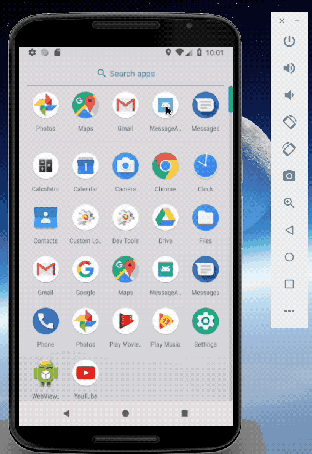
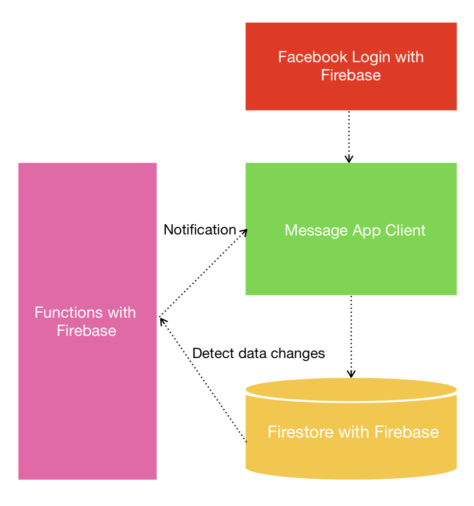

## MessaginApp
Application sending and receiving message using Firebase Auth, Cloud Messaging, Notification.



## Project Package Infomation
- "prop-types": "^15.6.2"
- "react": "16.4.1"
- "react-native": "0.56.0"
- "react-native-fbsdk": "^0.7.0"
- "react-native-firebase": "^4.3.8"
- "react-navigation": "^2.12.1"
- "react-redux": "^5.0.7"
- "redux": "^4.0.0"
- "redux-thunk": "^2.3.0
- "react-native-push-notification-popup": "^1.1.1"

## Need to know in advance
1. If you want to use Push Notification, You should set your Google Service Account Key in [`/functions/serviceAccountKey/messageApp.json`](https://github.com/7772/MessageApp/blob/development/functions/serviceAccountKey/messageApp.json).

2. The Push Notification feature of this app is currently possible to use only Android. iOS don't use that since Apple Developer ID Issued is delayed.

## Getting Started

1. Clone this project
```
  $ git clone https://github.com/7772/MessageApp.git
```

2. Install npm packages in root directory
```
  $ cd MESSAGEAPP
  $ npm install
```

4. Start App using emulator(android)
```
  $ react-native run-android
```

## Project Architecture




## Directory Structure
- `- android` Android Native Code
- `- ios` iOS Native Code
- `- src` App Code Base
  - `- components` Dumb Components
  - `- containers` Smart Components
  - `- redux` [ducks-modular-redux](https://github.com/erikras/ducks-modular-redux)
  - `- styles` App Styles
  - `- utils` APIs
  - `App.js`  Base Component
  - `Router.js` App Navigation